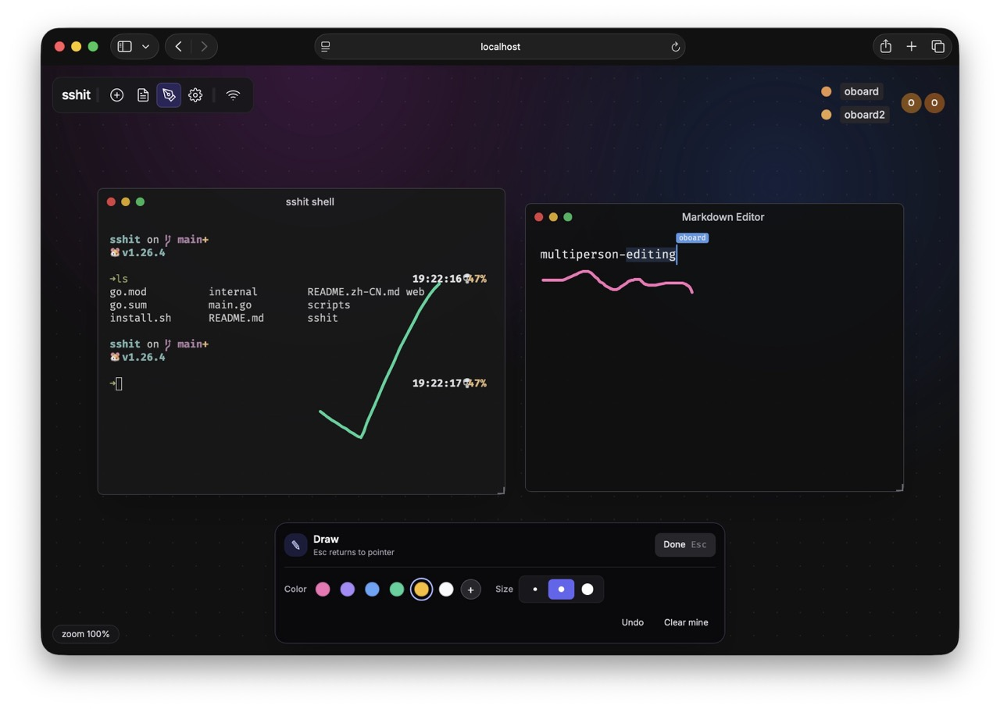

# sshit

[简体中文](README.zh-CN.md)

**Bring an SSH terminal to the browser—without giving up the native command-line experience.**

`sshit` is a lightweight SSH service that serves both standard SSH and a Web UI on one port. Connect with `ssh` for a familiar PTY-backed shell, or open the same address in a browser for a shared terminal workspace. Both entry points are served by a single Go binary with the Web frontend embedded—no separate web server deployment is needed.



```text
                    ┌─────────────┐
ssh -p 2222 host ──►│  SSH / PTY  │──► $SHELL
                    │             │
Browser ── HTTP/WS ►│    sshit    │──► shared Web PTYs
                    └─────────────┘
                         :2222
```

## Why SSH + Web UI?

SSH is reliable, universal, and script-friendly, while a Web UI makes ad-hoc access and collaboration easier. `sshit` combines both in one service:

- **Keep the SSH workflow** — connect with any SSH client for a real PTY and native shell experience.
- **No browser-side client installation** — open a URL for a full terminal; input, output, and terminal dimensions synchronize over WebSocket.
- **A shared workspace for collaboration** — Web users see the same terminal windows and can create, move, resize, or close them. Terminal output is retained and synchronized for users who join later.
- **More than a terminal** — the Web UI includes multi-user cursors, a shared Markdown editor, and a canvas for commands, notes, and discussion in one place.
- **One port, one binary** — connections are distinguished by their `SSH-` or HTTP prefixes; Go `embed` packages static frontend assets so no reverse proxy or standalone Node.js runtime is required.

> Shells created in the Web workspace are shared among connected browser users. Every SSH login, in contrast, receives its own PTY shell.

## Quick Start

### Install

The installer fetches the latest release for Linux x64, macOS arm64, or macOS x64:

```bash
curl -fsSL https://sshit.oboard.fun/install.sh | bash
```

It installs to `/usr/local/bin` by default. To use a directory in your home folder instead:

```bash
curl -fsSL https://sshit.oboard.fun/install.sh | INSTALL_DIR="$HOME/.local/bin" bash
```

For Windows x64, run this in PowerShell (it installs to `%LOCALAPPDATA%\\sshit\\bin` and adds that directory to your user `PATH`):

```powershell
irm https://sshit.oboard.fun/install.ps1 | iex
```

Download binaries for other supported platforms from [GitHub Releases](https://github.com/oboard/sshit/releases).

### Start the Server

```bash
sshit
```

By default, sshit listens on `0.0.0.0:2222`. On its first launch, it automatically creates an SSH host key at `~/.ssh/sshit_host_ed25519_key` and reuses it on subsequent launches.

### Connect in Two Ways

**SSH:**

```bash
ssh -p 2222 localhost
```

**Browser:**

Open <http://localhost:2222>. The page automatically establishes a WebSocket connection and provides an interactive terminal.

## Usage

### Keep Your SSH Workflow

SSH sessions start the service process's `$SHELL`, falling back to `/bin/sh` when it is unset. The terminal environment uses `xterm-256color`, enables true color, and synchronizes the SSH client's terminal dimensions.

```bash
# Choose a port
sshit --port 2022

# Bind to a specific address (short form: -a)
sshit --address 127.0.0.1 --port 2022

# Short form for the port
sshit -p 2022

# Connect to that port
ssh -p 2022 user@server.example
```

### Session Persistence (Restart Restore)

By default, sshit persists the web workspace to `~/.sshit/<port>/` and restores it after the server (or the machine) restarts. Restored windows come back with their position, size, and stacking order intact.

```bash
# Default: layout + terminal history + AI agent resume are all on
sshit

# Disable scrollback persistence (layout and agent resume still apply)
sshit --persist-history=false

# Disable persistence entirely
sshit --persist=false
```

What is restored:

- **Window layout** — every terminal and editor window's position, size, and z-order.
- **Terminal history** — each pane replays its previous screen contents. Plain shells reopen as fresh shells in their saved working directory; the underlying processes are not preserved.
- **Editor & drawing content** — Markdown documents and canvas drawings live in a shared CRDT document whose update log is persisted, so editor windows come back with their contents.
- **AI agent sessions** — terminals running a supported agent (`claude`, `codex`) are relaunched with their resume command (for example `claude --resume <id>`), so the conversation continues where it left off.

State is written to `~/.sshit/<port>/session.json` (layout), `~/.sshit/<port>/history/<id>.txt` (scrollback), and `~/.sshit/<port>/collab.json` (collaborative document). If history files exist from a previous run they are always replayed on restore — `--persist-history` only controls whether new output keeps being written.

> **Security note:** terminal scrollback can contain passwords, tokens, and command output. Treat `~/.sshit/` like your shell history — it is written with `0700`/`0600` permissions. Use `--persist-history=false` on shared machines.

### Collaborate in the Web Workspace

In the browser, you can:

1. Create terminal windows on the canvas.
2. Drag, resize, focus, or close terminals.
3. See the same terminal output as other connected users in real time.
4. Use shared Markdown windows and the canvas to document commands, steps, or troubleshooting notes.
5. Use the participant list and multi-user cursors to see who is in the workspace.

This makes `sshit` useful for remote demonstrations, pair troubleshooting, teaching, and temporary operations work where both terminal and browser users need access.

## Access Control

SSH and the Web UI do not require a password by default. This is appropriate only for local development or trusted networks. Before exposing the service, set a password and/or put it behind trusted network and access controls:

```bash
sshit --password 'change-me'
```

The same password is used for SSH password authentication and Web UI login:

```bash
ssh -p 2222 user@server.example
# Password: change-me
```

> `--password` is a simple shared-password mechanism. For production, also use controls such as firewalls, a VPN, reverse proxy/TLS, or other external authentication. Do not expose an unprotected instance to the public Internet.

## How It Works

After a connection reaches the TCP port, `sshit` inspects its leading bytes:

| Connection | Detection | Handling |
| --- | --- | --- |
| SSH | Starts with `SSH-` | Handed to the SSH server, which starts an independent PTY and shell |
| HTTP | Any other request | Serves the embedded Web UI |
| WebSocket | `/ws` | Carries Web terminal events, PTY input/output, and workspace state |
| WebSocket | `/collab` | Synchronizes Markdown, canvas, and collaboration state |

As a result, command-line and browser access coexist naturally: no extra ports and no separate services to choose between.

## Build from Source

Requirements: Go 1.22+, Node.js, and pnpm.

Frontend output is written to `internal/web/dist/`, then embedded in the Go binary. The generated directory is not committed, so build the frontend before running or building the Go program:

```bash
# 1. Build the frontend assets to embed
cd web
pnpm install --frozen-lockfile
pnpm run build
cd ..

# 2. Build or run
go build ./...
# or
go run . --port 2222
```

## Release Builds

GitHub Actions builds release artifacts for Linux x64, macOS arm64/x64, and Windows x64. Pushing a `v*` tag creates a GitHub Release and uploads the corresponding binaries.

## Stack

- **Server:** Go, `gliderlabs/ssh`, `creack/pty`, Gorilla WebSocket
- **Web UI:** Svelte, xterm.js, Yjs, CodeMirror
- **Distribution:** Go `embed` packages the compiled static assets in one executable

## License

This project is licensed under the [GNU Affero General Public License v3.0](LICENSE) (AGPL-3.0-only).

If you modify sshit and make the modified version available to users over a network, AGPL-3.0 requires that those users be offered the corresponding source code for that version. See [section 13 of the license](LICENSE) for details.
